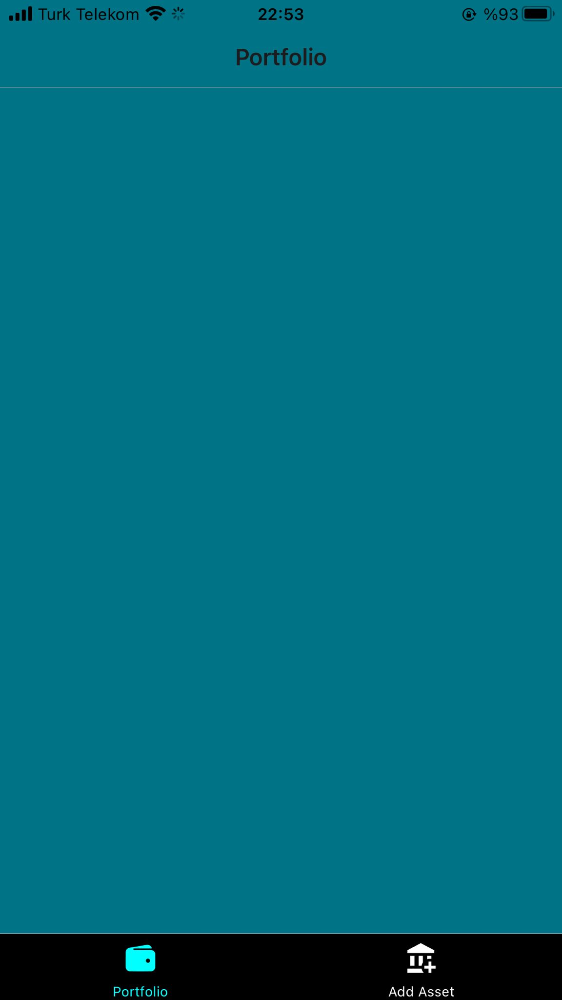
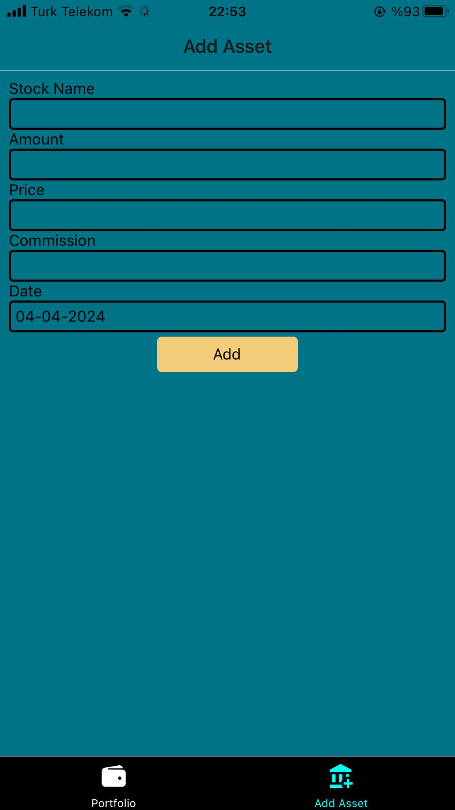
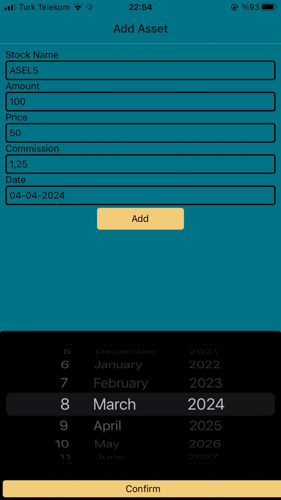
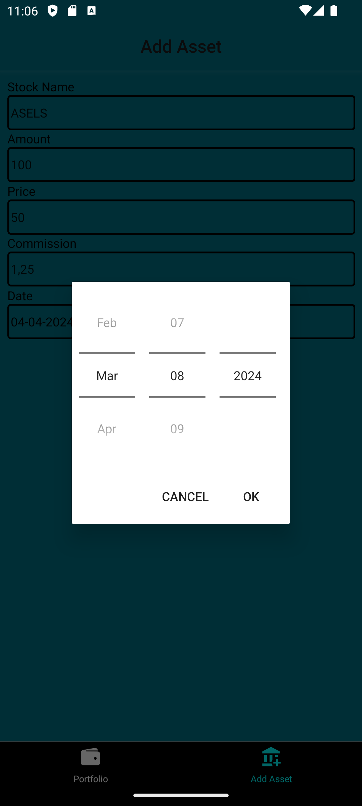
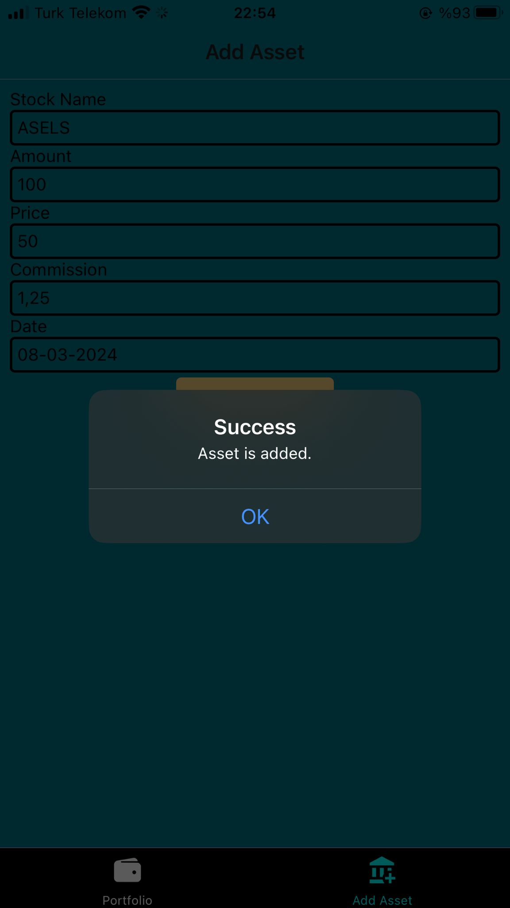
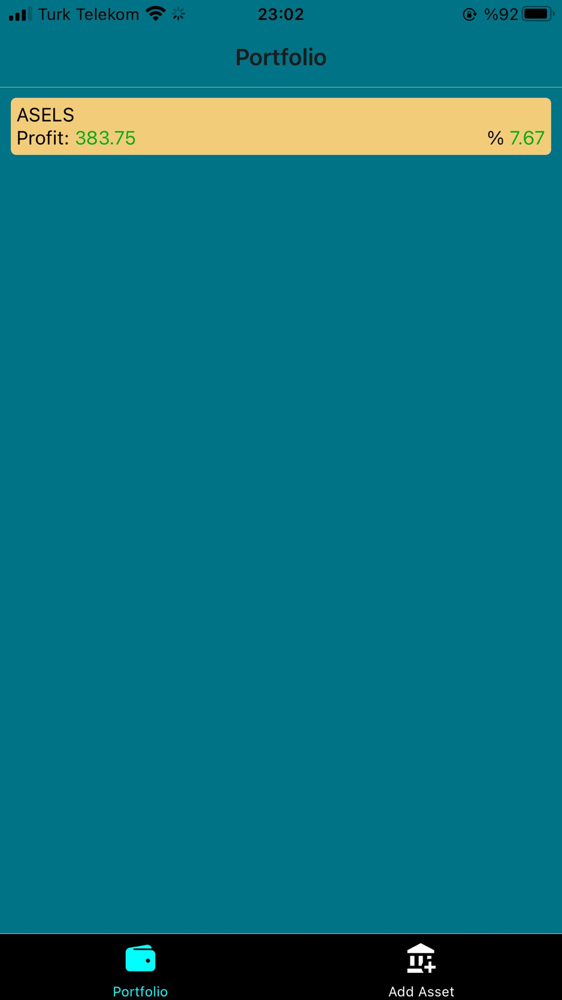
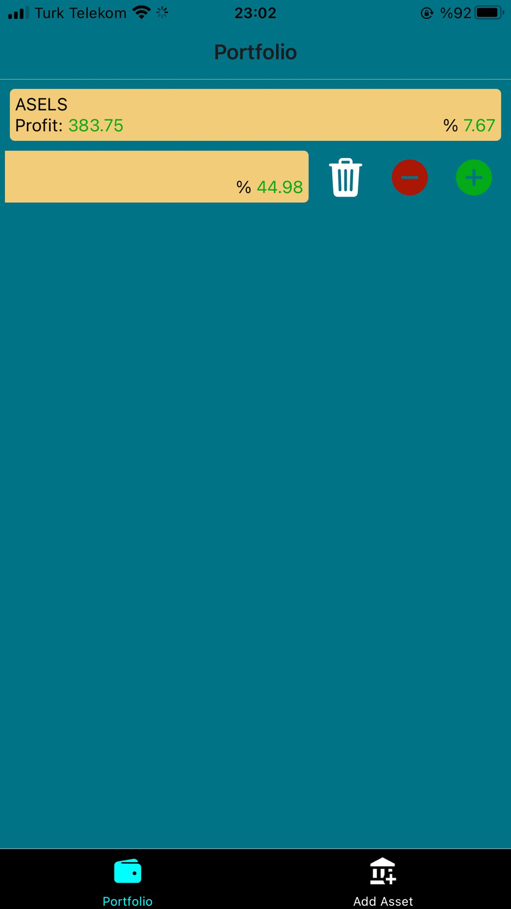
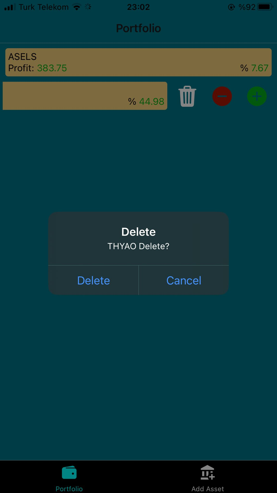

# portfolio-manager

Portfolio Manager App to learn React Native!
The user can see their stock portfolio and profit or loss.

To run this app you need to expo. You might want to check [Expo Documentation](https://docs.expo.dev/get-started/installation/).

In addition, you need to backend service to get stock prices. You can add them in .env file "EXPO_PUBLIC_BIST_STOCKS_API" "EXPO_PUBLIC_BIST_STOCK_API"

 

